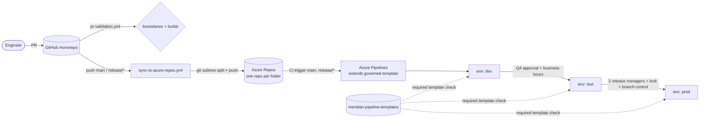

# Meridian Approval Platform

Greenfield, enterprise-shaped reference platform: a small approval workflow product
(a signed-in user can raise an approval and an approver can click **Approve**), built to
exercise **Azure DevOps and Git governance** as hard as possible.

* **GitHub** is the source of truth. This one repository holds every component as a
  top-level folder.
* **Azure DevOps** is the execution plane. Every mirrored folder becomes its own Azure Repo
  with its own pipelines, branch policies, environments, and Boards area path.
* [`repos.manifest.json`](repos.manifest.json) is the single source of truth for the
  folder -> repo -> pipelines -> policy-profile mapping. Every script in [`tooling/`](tooling/)
  reads it.
* [`docs/reference-feedback.md`](docs/reference-feedback.md) is the running log of what the
  [azp-reference](https://coolhome.github.io/azp-reference/) documentation got right, what it
  missed, and what tripped us up while building this, context by context.

## Repository map

| Folder | Azure Repo | Tier | What lives here |
| --- | --- | --- | --- |
| [`governance/`](governance/) | `meridian-governance` | governance | ADRs, branch-policy profiles, environment/check definitions, team model, wiki, overlay files stamped into every repo |
| [`pipeline-templates/`](pipeline-templates/) | `meridian-pipeline-templates` | governance | The only pipelines allowed to deploy: `extends` templates enforced by environment checks |
| [`platform-infrastructure/`](platform-infrastructure/) | `meridian-platform-infrastructure` | platform | Subscription-scope Bicep: resource groups, Log Analytics + App Insights, Key Vault, ACR, Container Apps environment, Cosmos, Storage, managed identities, RBAC, Azure Policy |
| [`platform-libraries/`](platform-libraries/) | `meridian-platform-libraries` | library | `Meridian.Messaging.Contracts` (schemas + NuGet) and `Meridian.ServiceDefaults` (auth, telemetry, health, resilience) published to Azure Artifacts; queue definitions |
| [`identity-service/`](identity-service/) | `meridian-identity-service` | service | Resolves the signed-in principal and platform roles (Entra ID groups -> roles) |
| [`approval-service/`](approval-service/) | `meridian-approval-service` | service | Approval aggregate, decisions, event publishing to Storage Queues |
| [`app-backend/`](app-backend/) | `meridian-app-backend` | service | Backend-for-frontend that fronts identity + approval services for the SPA |
| [`app-frontend/`](app-frontend/) | `meridian-app-frontend` | service | React/Vite SPA deployed to Azure Static Web Apps |
| [`worker-jobs/`](worker-jobs/) | `meridian-worker-jobs` | service | Queue processor + escalation job running as a KEDA-scaled Container App |
| [`containers/`](containers/) | `meridian-containers` | platform | Hardened base images, ACR Tasks, image standards, scheduled rebuilds |
| [`observability/`](observability/) | `meridian-observability` | platform | Alerts, action groups, availability tests, workbooks, KQL, SLOs |
| [`tooling/`](tooling/) | *(GitHub only)* | tooling | Sync, bootstrap, pipeline and policy automation, boundary checks |

## Boundaries that are enforced, not just documented

* **No cross-folder references.** Each folder must build alone because it becomes its own
  repo. Shared code flows through NuGet packages on Azure Artifacts, shared pipeline logic
  through the templates repo. `tooling/Test-RepoBoundaries.ps1` fails CI on violations.
* **Only governed pipelines deploy.** Environments carry a *required template* check, so a
  pipeline that does not `extends` from `meridian-pipeline-templates` cannot target them.
* **Consumers cannot smuggle scripts into builds.** The extends templates reject any step in
  `preBuildSteps` whose task is not on the allow-list, using the compile-time
  template-not-found trick from azp-reference example 01.
* **Promotion is gated.** `dev` auto-deploys, `test` needs QA approval inside business hours,
  `prod` needs two release managers, an exclusive lock, branch control (`main`/`release/*`
  only) and the required template.
* **Branch policies are code.** Profiles in `governance/policies/branch-policy-profiles.json`
  are applied per repo tier by `tooling/Set-AdoBranchPolicies.ps1` (idempotent).
* **Governance overlay drift is a build break.** Files under `governance/templates/overlay`
  are stamped into every mirrored folder; a diff fails CI.
* **Templates are pinned.** Every consumer references the templates repo at a tag. Rolling a
  new template version is an opt-in change in each consumer, never a global flip.

## Flow



## Quick start

1. Edit `repos.manifest.json` (organization URL, GitHub repo) and
   `governance/environments/environments.json` (subscription / tenant / identity IDs).
2. Bootstrap Azure DevOps once (project, teams, area paths, feed, wiki, environments and
   checks, variable groups, workload-identity service connections, project pipeline settings):

   ```bash
   pwsh ./tooling/Initialize-AzureDevOps.ps1
   ```

3. Mirror the folders into Azure Repos, then create pipelines and apply branch policies:

   ```bash
   pwsh ./tooling/Publish-Platform.ps1
   ```

4. Complete the manual steps the bootstrap reports (see below). The platform is not fully
   provisioned until they are done.

5. From then on the GitHub workflow `sync-to-azure-repos.yml` does step 3 on every push to
   `main` or `release/*` for the folders that changed.

## Steps automation cannot perform

**This platform does not bootstrap end to end.** Two steps need a human, and a pipeline that
depends on either will fail in a way that looks like a code defect but is not.
`Initialize-AzureDevOps.ps1` prints them as a numbered block when it finishes.

| Step | Why it is manual | Blast radius if skipped |
| --- | --- | --- |
| **Grant the project build service Contributor on the `meridian` Artifacts feed** | A feed created through REST grants the build service nothing, and the `packaging/feeds/{feed}/permissions` PATCH is accepted (HTTP 200) but applies nothing — see [`docs/reference-feedback.md`](docs/reference-feedback.md). No scripted identity form has yet been shown to persist. | `platform-libraries` cannot publish; `app-frontend` gets `npm ci` 403; every .NET service fails to restore. 6 of 10 pipelines. |
| **Approve the `shared` environment** the first time a run pauses on it | An approval is a human gate by definition. Automating it away would defeat the control the platform exists to demonstrate. | `platform-infrastructure` (Deploy shared) and `containers-base-images` (Promote) wait indefinitely. |

Both have scripted attempts that run from an operator terminal with `AZDO_PAT` set:

```bash
pwsh ./tooling/Grant-FeedRole.ps1 -ReadOnly      # inspect the current role, change nothing
pwsh ./tooling/Grant-FeedRole.ps1                # try four identity forms, read back after each
pwsh ./tooling/Approve-PendingApprovals.ps1 -Wait  # approve each pause as it appears
```

`Grant-FeedRole.ps1` is an experiment as much as a tool: if one of its four identity forms
persists, say which in `docs/reference-feedback.md` and the bootstrap can be fixed to do it.
Until then, the portal is the reliable path:
Artifacts > `meridian` > gear > Permissions > Add users/groups > `Meridian Build Service (<org>)` > Contributor.

The approval step stays manual on purpose. The feed grant is the one that should eventually
disappear, and it is tracked as a defect in the bootstrap, not as a design decision.

## Local development

Each service README shows how to run it in `Development` auth mode without Entra ID (header-based
identity, refused outside `ASPNETCORE_ENVIRONMENT=Development`). Requirements: .NET 10 SDK,
Node 24, Azurite for the queue paths.

Service `nuget.config` files map `Meridian.*` to the Azure Artifacts feed. Before the feed
exists (or offline), pack the libraries into a local folder and restore with a config that
points the `meridian` source at it, exactly as `.github/workflows/pr-validation.yml` does:

```bash
dotnet pack platform-libraries -c Release -p:PackageVersion=1.0.0 -o /tmp/meridian-feed
dotnet restore approval-service --configfile /tmp/nuget.local.config   # see the workflow for the file
```

## Cost posture

Every environment, `prod` included, runs the minimal-cost parameters from ADR 0007: Container
Apps scale to zero at 0.25 vCPU, LRS storage, Basic registry, serverless single-region Cosmos,
30-day logs capped at 1 GB/day, Free static sites, one availability probe. The governance gates
are unchanged because they cost nothing.

| Layout | Approximate idle cost per month |
| --- | --- |
| `shared` + `dev` | ~$25 |
| `shared` + `dev` + `test` + `prod` | ~$60 to $80 |

Scaling any environment up is a parameter file change through the normal PR gates.

## What was verified in this scaffold

| Check | Result |
| --- | --- |
| `platform-libraries` build + 8 tests | pass |
| `identity-service`, `approval-service`, `app-backend`, `worker-jobs` build + 16 tests | pass (against a local pack of the libraries) |
| `app-frontend` lint, 2 tests, production build | pass |
| Every `.bicep` and `.bicepparam` (`az bicep build`) | pass |
| Every PowerShell script parses; manifest loads | pass |
| Every YAML file parses | pass |
| `tooling/Test-RepoBoundaries.ps1` | pass, 11 mirrored folders |

Not verified here: anything that needs an Azure DevOps organization or an Azure subscription
(bootstrap, sync, pipeline compilation, deployments). Those scripts follow the documented REST
and CLI contracts recorded in `docs/reference-feedback.md`.
