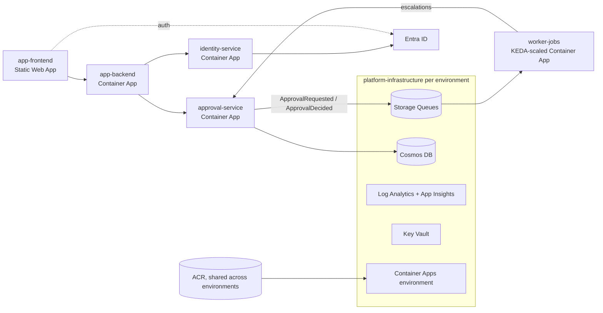

# Architecture

## Runtime

## Resource naming

`{prefix}-{env}-{component}-{type}` with prefix `mrd`. Globally unique resources append a
per-environment `uniqueSuffix` from the variable group.

| Resource | Name |
| --- | --- |
| Resource groups | `rg-mrd-{env}-platform`, `rg-mrd-{env}-apps`, `rg-mrd-{env}-data` |
| Container Apps environment | `cae-mrd-{env}` |
| Key Vault | `kv-mrd-{env}-{suffix}` |
| Storage | `stmrd{env}{suffix}` |
| Cosmos | `cosmos-mrd-{env}-{suffix}` |
| App Insights | `appi-mrd-{env}` |
| Managed identity | `id-mrd-{env}-{service}` |
| Container App | `ca-mrd-{env}-{service}` |
| ACR (shared) | manifest `containerRegistry` |

## Ownership

| Area | Owner |
| --- | --- |
| Shared infrastructure, templates, libraries, base images | Platform Engineering |
| identity-service | Identity Team |
| approval-service, worker-jobs | Approvals Team |
| app-frontend, app-backend | Experience Team |
| Alerts, SLOs | SRE |
